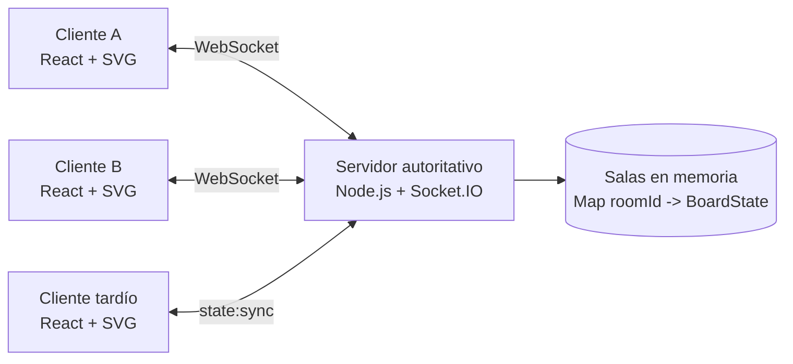

# NexoBoard - tablero colaborativo mediante WebSockets

Aplicación de tablero colaborativo en tiempo real para la actividad **[S10-B]**. Dos o más personas pueden compartir una sala, observar su presencia y sus punteros, y crear, mover, editar, conectar o eliminar bloques sin recargar la página.

## Requisitos

- Node.js 20 o superior
- npm 10 o superior

## Ejecución reproducible

```bash
npm install
npm run dev
```

Abra `http://localhost:5173` en dos o más ventanas. Use el mismo identificador para compartir una sala y uno distinto para comprobar el aislamiento.

Para probar la versión de producción:

```bash
npm run build
npm start
```

La aplicación completa quedará disponible en `http://localhost:3001`.

## Validación

```bash
npm run check
npm run build
# Con el servidor iniciado en otra terminal:
npm run test:integration
```

`npm run check` ejecuta TypeScript y cinco pruebas unitarias. La integración abre clientes Socket.IO reales y verifica creación de operaciones, incorporación tardía, retiro de presencia, reconexión y aislamiento de salas.

## Arquitectura



- El cliente React representa bloques y flechas con SVG.
- Socket.IO está configurado exclusivamente con `transports: ['websocket']` tanto en servidor como en cliente.
- El servidor conserva un estado independiente por sala y es la única autoridad que acepta y ordena operaciones.
- El estado vive en memoria: reiniciar el servidor limpia las salas, según el alcance solicitado.

## Estado compartido

Cada sala contiene:

```ts
type BoardState = {
  roomId: string;
  version: number;
  blocks: Block[];
  connections: Connection[];
  participants: Participant[];
};
```

Los bloques tienen identificador, posición, dimensiones, etiqueta, color y fecha de última actualización. Las conexiones guardan los identificadores de origen y destino; sus coordenadas se calculan desde el centro de los bloques al dibujar, por lo que las flechas se conservan y actualizan al moverlos. Al eliminar un bloque, el servidor elimina también todas sus conexiones.

## Protocolo de eventos

| Dirección | Evento | Carga principal | Propósito |
|---|---|---|---|
| Cliente → servidor | `room:join` | `{ roomId, name }` | Crear o ingresar a una sala. |
| Servidor → cliente | `state:sync` | `BoardState` | Entregar el estado vigente antes de habilitar interacciones. |
| Servidor → sala | `presence:joined` | `Participant` | Anunciar una presencia nueva. |
| Servidor → sala | `presence:left` | `{ participantId }` | Retirar a quien se desconecta. |
| Cliente → servidor | `cursor:move` | `{ x, y }` | Enviar únicamente la posición actual del puntero. |
| Servidor → otros | `cursor:moved` | `{ participantId, x, y }` | Mostrar el puntero remoto sin reenviar el tablero. |
| Cliente → servidor | `board:operation` | `BoardOperation` | Solicitar crear, editar, mover o eliminar un bloque o conexión. |
| Servidor → sala | `board:applied` | `{ operation, version, serverTime, actorId }` | Confirmar y propagar una operación ya validada. |
| Servidor → cliente | `server:error` | `{ message }` | Comunicar un rechazo comprensible. |

Las operaciones permitidas son `block:create`, `block:update`, `block:delete`, `connection:create` y `connection:delete`. El servidor valida todos los identificadores, textos, colores, coordenadas, dimensiones y relaciones con Zod.

## Estrategia de sincronización y concurrencia

1. Al ingresar o reconectarse, el cliente pasa a `syncing` y no puede editar.
2. El servidor incorpora la presencia y envía un `state:sync` completo de esa sala.
3. Solo después del envío marca el socket como listo y comienza a aceptar punteros y operaciones.
4. Cada operación válida se aplica primero al estado autoritativo, incrementa `version` y después se difunde.
5. Los clientes ignoran eventos repetidos o con una versión anterior.

La regla de competencia es **último cambio aceptado por el servidor**. Node.js procesa los eventos de forma secuencial; si dos usuarios cambian el mismo bloque casi simultáneamente, gana la operación con la versión más alta asignada por el servidor. Esta regla es simple, determinista y adecuada al alcance sin CRDT ni transformación operacional.

Los punteros son información efímera: se envían con `volatile.emit`, no alteran la versión del tablero y nunca provocan el envío del estado completo.

## Estructura del proyecto

```text
server/                 servidor WebSocket y estado autoritativo
shared/protocol.ts      tipos compartidos del protocolo
src/                    interfaz React y representación SVG
scripts/                verificación de integración WebSocket
docs/                   guía de demostración y material de entrega
```

## Seguridad y límites

- Nombres, salas y operaciones se validan en el servidor.
- Las emisiones usan siempre el `roomId` asociado al socket; el cliente no puede elegir una sala distinta en una operación.
- No hay persistencia, autenticación avanzada, historial, deshacer/rehacer, CRDT ni carga de archivos, de acuerdo con el alcance.

## Evidencias y video

Las capturas, grabaciones y archivos finales se excluyen mediante `.gitignore`; el repositorio contiene únicamente código, documentación y pruebas. Consulte [`docs/GUIA_EVIDENCIAS_Y_VIDEO.md`](docs/GUIA_EVIDENCIAS_Y_VIDEO.md) para producir una demostración de menos de tres minutos.

## Licencia

Uso académico.
